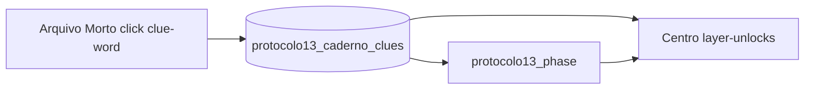

# Modelo do ARG

Visão do sistema de progressão: pistas, Caderno, fases, camadas e deep-links.

---

## Pistas (clues)

**Implementado:** pistas do Arquivo Morto são botões `<button class="clue-word" data-clue-id="…">` que não navegam — registram ID no estado e no `localStorage`.

| Artefato | Função |
|----------|--------|
| `arquivo-morto/data/pistas.json` | Metadados: `id`, `titulo`, `descricao`, `categoria`, `localizacao`, … |
| `protocolo13_caderno_clues` | Array de IDs coletados (ponte transmídia) |
| UI do Caderno | Lista títulos do JSON (`titulo`), não o texto do botão |

**Paralelo no Centro:** symbol layer de pistas da Rua São Bento (`centro/features/pistas.js`) — conceito narrativo semelhante, mecânica distinta (mapa, não blog).

---

## Caderno do Arquivista

**Implementado** no Arquivo Morto:

- Ledger lateral (`[data-clue-list]`) com filtro e busca.
- Ao clicar clue válida: marca todos os nós com mesmo `data-clue-id` (`is-collected`, `aria-pressed="true"`).
- Persistência: `localStorage.setItem("protocolo13_caderno_clues", JSON.stringify([...ids]))`.

**REQUIRED_CLUES** (conclusão narrativa do Registro 001) — **implementado** em `arquivo-morto.js`:

```text
peso-fundacao, aresta-fria, aurora-maloca, agua-calada
```

Com as 4 coletadas, o bloco `[data-clue-conclusion]` revela instruções e link “Abrir MapLibre”. As 4 pistas novas (PR #6) entram no catálogo e no smoke, mas **não** fazem parte de `REQUIRED_CLUES`.

---

## Fases (1–13)

**Implementado:** `centro/data/catalog/phase-gates.json` + `centro/features/protocolo-phase.js`.

| Mecanismo | Comportamento |
|-----------|----------------|
| `protocolo13_phase` | Fase actual (1–13) em `localStorage` |
| `layerMinPhase` | Camada exige fase mínima (sidebar bloqueada por fase) |
| `clueCountAdvance` | Sobe fase automaticamente quando contagem de pistas no caderno atinge limiares |
| Badge | `#centro-phase-badge` — “Fase N/13 — {título}” |

**Títulos das 13 fases** (implementado em `phase-gates.json`): Superfície → Hidrografia soterrada → Património rígido → Acervo e memória → Geotecnia → Arquivo superficial → Rasgue o Asfalto → … → Permanência.

### Progressão real vs roadmap

| | Progressão real (hoje) | Roadmap |
|--|------------------------|---------|
| **Pistas no blog** | 8 IDs em `pistas.json` | Mais pistas até 11/14+ para alimentar `clueCountAdvance` |
| **Fases 5–6** | Gates de camada existem (`layerMinPhase` 5 e 6) | Avanço **só por coleta** até 11/14 pistas ainda impossível com 8 pistas |
| **Conteúdo narrativo fases 2–13** | Parcial (copy, camadas wired) | Arco completo PROTOCOLO 13 ALMAS (AGENT.md §12.1) |

**Interpretação narrativa:** o jogador pode sentir “travamento” na fase 6 mesmo com `guardiao-tampa` — **esperado** se `protocolo13_phase` &lt; 6. Desbloqueio de **clue** ≠ desbloqueio de **fase**.

### `clueCountAdvance` (implementado)

| minClues | Fase alvo |
|----------|-----------|
| 2 | 2 |
| 5 | 3 |
| 8 | 4 |
| 11 | 5 (**roadmap** — impossível só com 8 pistas) |
| 14 | 6 (**roadmap**) |

Com 8 pistas coletadas, a fase automática máxima por contagem é **4**.

---

## Desbloqueio de camadas (layer-unlocks)

**Implementado:** `centro/data/catalog/layer-unlocks.json` — mapa `layerId → [clueId, …]`.

Runtime (`centro/features/layer-unlocks.js`):

- `isLayerUnlocked(layerId)` — todas as clues listadas devem estar em `protocolo13_caderno_clues`.
- UI: `.layer-row--locked`, checkbox desabilitado, toast in-character.

Uma camada pode exigir **clue e fase** (`isLayerUnlocked` **e** `isLayerPhaseUnlocked`).

**Exemplo implementado:** `centro_arquivo_superficial__point` exige clue `guardiao-tampa` **e** fase mínima **6** (`layerMinPhase`).

---

## Deep-links e debug

| Query / chave | Efeito | Uso |
|---------------|--------|-----|
| `?clues=id1,id2` | Merge IDs em `protocolo13_caderno_clues` | Teste, smoke, Arquivista → Centro |
| `?phase=N` | Define `protocolo13_phase` (1–13) | Debug / QA |
| `?debug=1` ou `centroDebug` | Inspector de features no mapa | Dev; jogador pode achar via F12 |

**Não confundir** deep-link com progressão “legítima” do jogador — são ferramentas operacionais documentadas em [manual-smoke.md](./manual-smoke.md).

---

## Visão subterrânea (Centro)

**Implementado** em `centro/features/subterranean-cutaway.js`: conjunto **diferente** de `REQUIRED_CLUES` para a feature 3D:

```text
agua-calada, aresta-fria, peso-fundacao
```

Não substitui `REQUIRED_CLUES` do Arquivo Morto (4 pistas para conclusão do post).

---

## Fluxo de dados (resumo)



Ver [player-flow.md](./player-flow.md) para o caminho do jogador.
